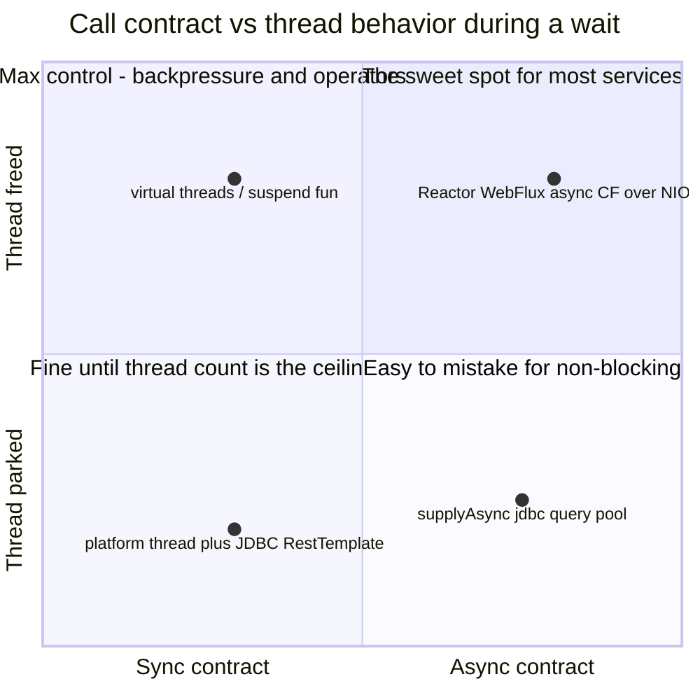
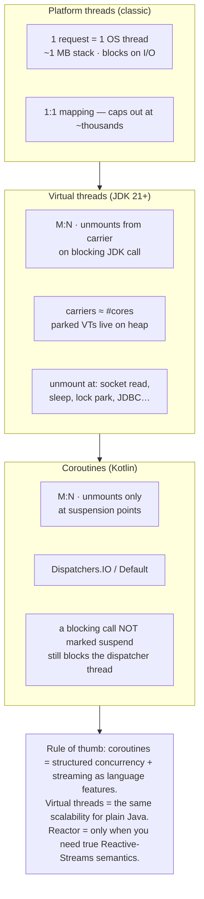

# §0 Mental model

## §0.1Vocabulary: async ≠ parallel ≠ non-blocking

These words get used interchangeably; they name **orthogonal properties**. Every technology in this sheet is a different combination of them — misdiagnosing which property you actually need is how teams end up on WebFlux for a CRUD service.

| Term | A property of… | Meaning | Litmus example |
|---|---|---|---|
| **Blocking / non-blocking** | how the *wait* is implemented | Does an OS thread sit parked inside the call until the result arrives — or is the wait registered with the OS (epoll/NIO) and the thread freed to do other work? | `socket.read()` on a platform thread vs an NIO selector loop |
| **Synchronous / asynchronous** | the *call contract* | Sync: the result is in hand when the call returns. Async: the call returns immediately and the result is delivered later — via callback, future, or resumption. | `Quote quote(id)` vs `CompletableFuture<Quote> quote(id)` |
| **Concurrent** | program *structure* | Multiple tasks in progress over overlapping time windows. Interleaving on a single thread counts — no second core required. | 10k coroutines multiplexed on one dispatcher thread |
| **Parallel** | *hardware* execution | Multiple tasks executing at the same instant on different cores. Parallelism is a subset of concurrency; it buys throughput for CPU-bound work, nothing for waits. | `list.parallelStream().map(…)` |

*fig 0a — contract × wait behavior. Parallelism is a third, independent axis: how many cores execute at once.*

> **THE TRAPS:** **Async ≠ non-blocking**: `supplyAsync` wrapping JDBC is asynchronous to the caller while a pool thread blocks all the same. **Non-blocking ≠ async**: a `suspend fun` or a blocking call on a virtual thread gives a synchronous contract over a freed thread. **Concurrent ≠ parallel**: 100k coroutines can interleave on one thread, while `parallelStream` is parallel yet fully synchronous — the caller waits.

## §0.2Who parks whom

All three models solve the same problem — **don't hold an OS thread hostage during I/O** — at different layers. Coroutines unmount at `suspend` points (compiler-generated state machines, CPS transform). Virtual threads unmount at blocking JDK calls (JVM-managed continuations). Platform threads never unmount; they just block.

*fig 0 — thread mapping. "Parked"/"suspended" work costs a heap object, not an OS thread.*
