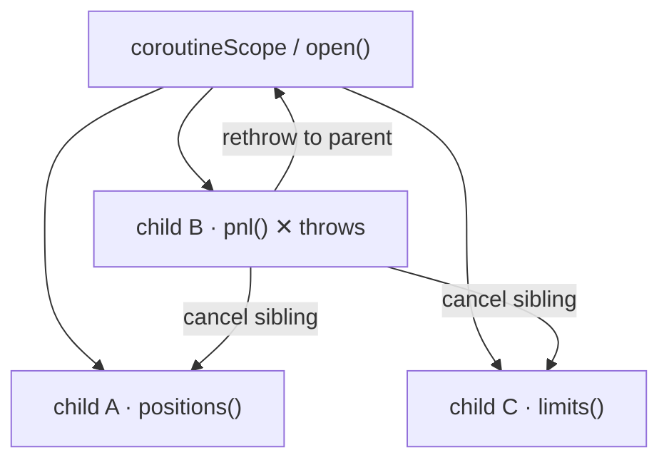

# §3 Structured concurrency

The core contract: **a concurrent task cannot outlive the block that started it**, failures propagate to the parent, and cancellation propagates to children. Kotlin has had this since 2018; Java is standardizing the same shape via `StructuredTaskScope` (JEP 505, 5th preview in JDK 25 — the JDK 21-era `ShutdownOnFailure` constructors were replaced by `open(Joiner)`). It is **still a preview API**: JDK 26 (JEP 525) renames `anySuccessfulResultOrThrow` → `anySuccessfulOrThrow`, makes `allSuccessfulOrThrow` return a `List`, and adds `Joiner.onTimeout()`. Pin your JDK before depending on the exact spelling.




*fig 1 — failure propagation: one child fails → siblings cancelled → exception rethrown at the join point.*

#### KOTLIN · coroutineScope + async

```kotlin
suspend fun dashboard(id: String): Dashboard = coroutineScope {
    val pos = async { positions(id) }
    val pnl = async { pnl(id) }
    Dashboard(pos.await(), pnl.await())
}   // pnl throws → pos cancelled → exception rethrown here

// race — first success wins, loser cancelled:
suspend fun fastest(): Px = coroutineScope {
    select {
        async { primary() }.onAwait { it }
        async { backup()  }.onAwait { it }
    }.also { coroutineContext.cancelChildren() }
}
```

#### JAVA · StructuredTaskScope (JDK 25, --enable-preview)

```java
Dashboard dashboard(String id) throws Exception {
    try (var scope = StructuredTaskScope.open()) {   // forks run on VTs
        var pos = scope.fork(() -> positions(id));
        var pnl = scope.fork(() -> pnl(id));
        scope.join();          // any failure → cancel siblings, throw
        return new Dashboard(pos.get(), pnl.get());
    }
}
// race:
try (var s = StructuredTaskScope.open(
        Joiner.<Px>anySuccessfulResultOrThrow())) {
    s.fork(() -> primary()); s.fork(() -> backup());
    return s.join();          // first success; loser interrupted
}
// deadline for the whole tree:
// StructuredTaskScope.open(joiner, cf -> cf.withTimeout(ofSeconds(2)))
```

> JDK 21–24 preview spelling: `new StructuredTaskScope.ShutdownOnFailure()` + `scope.join().throwIfFailed()`. Same semantics, older API.

#### JAVA · without virtual threads or StructuredTaskScope

```java
var pos = CompletableFuture.supplyAsync(() -> positions(id), pool);
var pnl = CompletableFuture.supplyAsync(() -> pnl(id), pool);
try {
    CompletableFuture.allOf(pos, pnl).join();
} catch (CompletionException e) {
    pos.cancel(true); pnl.cancel(true);   // manual, and…
    // …cancel(true) does NOT interrupt a running supplyAsync task!
    throw e;
}
```

> No parent–child relationship, no automatic sibling cancellation, no scoping of lifetimes. This is exactly the gap JEP 505 and coroutines both close.
