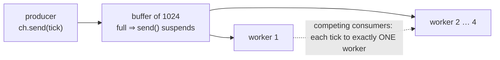

# §6 Channels — handing work between coroutines

A `Channel<T>` is a queue whose `send`/`receive` **suspend** instead of blocking. Suspension on a full buffer *is* the backpressure mechanism — no operators required.

> **THE GOAL:** All three versions below build the **same pipeline**: one producer reads a market-data feed, a bounded buffer of 1024 sits in the middle, and 4 workers index ticks in parallel. Each tick must be handled by **exactly one** worker, and if the workers fall behind, the producer must be slowed down rather than the buffer growing without bound.




*fig 2 — suspension IS the backpressure. Nothing is polled, nothing is dropped.*

#### KOTLIN · the complete pipeline

```kotlin
suspend fun indexFeed(feed: Flow<Tick>) = coroutineScope {

    val ch = Channel<Tick>(capacity = 1024)      // the bounded buffer

    // ── PRODUCER ────────────────────────────────────────────────
    launch {
        try {
            feed.collect { tick ->
                ch.send(tick)      // SUSPENDS while the buffer is full.
            }                     // The thread is released; the producer
        } finally {             // simply stops pulling from the feed.
            ch.close()           // broadcasts "no more items" to ALL workers
        }
    }

    // ── 4 WORKERS, all receiving from the SAME channel ──────────
    repeat(4) {
        launch {
            for (tick in ch) {    // suspends while empty; each tick is
                index(tick)         // delivered to exactly ONE worker
            }                     // loop exits cleanly once ch is closed AND drained
        }
    }
    // coroutineScope waits here for the producer + all 4 workers.
    // If any of them throws, the others are cancelled (see §3).
}
```

> Three things do real work here: `send` suspending gives backpressure for free, `close()` is a first-class end-of-stream signal that terminates every consumer's `for` loop, and `coroutineScope` guarantees no worker outlives the function.

#### JAVA · the same pipeline, on virtual threads

```java
// The translation is mechanical:
//   Channel(1024)  ->  ArrayBlockingQueue(1024)
//   send / receive ->  put / take   (BLOCK instead of suspend)
//   close()        ->  a "poison pill" sentinel  (no built-in equivalent)
// On virtual threads, a blocked put/take unmounts the carrier —
// so blocking here costs about what suspending costs in Kotlin.

void indexFeed(Iterable<Tick> feed) throws InterruptedException {

    var queue  = new ArrayBlockingQueue<Tick>(1024);
    final Tick POISON = Tick.SENTINEL;   // stands in for close()

    try (var exec = Executors.newVirtualThreadPerTaskExecutor()) {

        // ── PRODUCER ────────────────────────────────────────────
        exec.submit(() -> {
            for (Tick t : feed) {
                queue.put(t);      // BLOCKS while full — but only a virtual
            }                     // thread parks, so this IS backpressure
            for (int i = 0; i < 4; i++)
                queue.put(POISON);  // one pill per worker, so each one exits
            return null;
        });

        // ── 4 WORKERS ───────────────────────────────────────────
        for (int i = 0; i < 4; i++) {
            exec.submit(() -> {
                while (true) {
                    Tick t = queue.take();   // parks while empty; one tick,
                    if (t == POISON) return null;  // one worker
                    index(t);
                }
            });
        }
    }  // close() on the executor waits for producer + all workers
}
```

> What's genuinely missing versus Kotlin: a real `close()` (hence the pill), `select` over several queues, and conflation. What you gain: plain, debuggable, thread-per-task code with true stack traces.

#### JAVA · the same pipeline, pre-Loom

```java
// The SAME BlockingQueue code still compiles and runs. The problem
// is cost: every parked producer/consumer holds a PLATFORM thread
// (~1 MB of stack). A few hundred pipelines and you are out of
// threads long before you are out of CPU.
//
// The reactive answer inverts the design: NOBODY waits. Instead of
// a consumer blocking on take(), the producer PUSHES items to
// subscribers, and demand travels back upstream as a protocol
// (Subscription.request(n)) rather than as a parked thread.
//
// A "Sink" is Reactor's push-end of a stream: the object you call
// from ordinary imperative code to feed items INTO a Flux.

Sinks.Many<Tick> sink = Sinks.many()
        .multicast()                    // one stream, many subscribers
        .onBackpressureBuffer(1024);    // the bounded buffer

// ── PRODUCER: called from wherever the feed already lives ──
void onTick(Tick t) {
    Sinks.EmitResult res = sink.tryEmitNext(t);  // returns IMMEDIATELY
    if (res.isFailure()) {          // buffer full / no demand:
        metrics.dropped();          // there is no thread to park, so YOU
    }                              // must choose: drop, retry, or fail
}

// ── 4 WORKERS: .parallel(4) splits the stream into 4 "rails",
//    each element going to exactly one rail — the competing-
//    consumers behaviour a Channel gives you by default.
sink.asFlux()
    .parallel(4)
    .runOn(Schedulers.parallel())
    .subscribe(this::index);
```

> Note the semantic trap: a plain `multicast()` Flux **broadcasts** every element to every subscriber — unlike a Channel, where each element goes to one consumer. `.parallel(n)` is what restores work-distribution. And backpressure is no longer automatic: `tryEmitNext` can fail and you must handle it.

#### KOTLIN · `select` — waiting on several channels at once (no JDK equivalent)

```kotlin
// Take whichever arrives FIRST, from any of several sources,
// with a timeout as just another branch. In Java you would hand-roll
// this with a shared queue, a poller, or CompletableFuture.anyOf.
while (isActive) {
    select<Unit> {
        ticks.onReceive  { t -> handleTick(t) }     // a tick arrived first
        orders.onReceive { o -> handleOrder(o) }    // an order arrived first
        onTimeout(500.milliseconds) { heartbeat() }  // nothing arrived at all
    }
}
```
