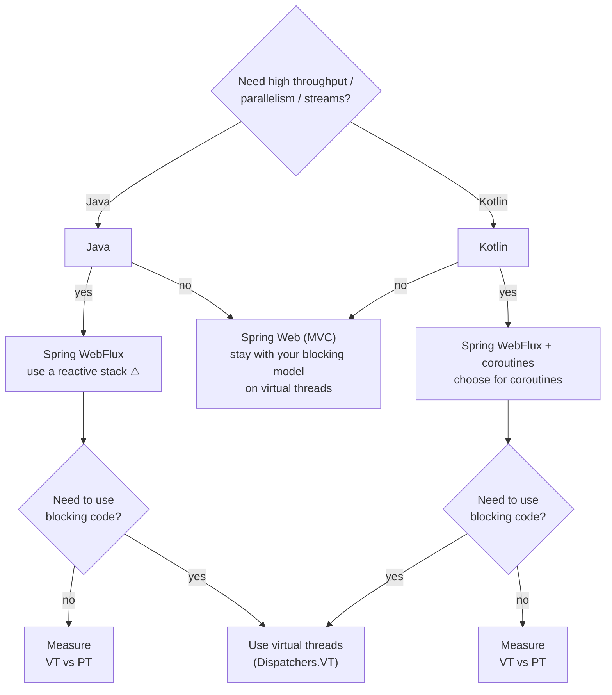

# §10 WebMVC vs WebFlux — the post-Loom decision

Before Loom, WebFlux's core selling point was escaping the thread-per-request ceiling. **Virtual threads erase that argument** — the framing this section follows is Urs Peter's (§13). What remains is *semantics*: Reactive-Streams backpressure as a real protocol, streaming operator composition, and an ecosystem that is non-blocking all the way down. If you don't need those, WebMVC + VT is the simpler system — true stack traces, working ThreadLocals/MDC, plain JDBC, ordinary debugging.




*fig 3 — **Urs Peter's decision tree**, redrawn from his "Adding Virtual Threads" webinar (§13). Language first, workload second, then "do I need blocking code?" — with virtual threads as the answer either way: the default runtime for the blocking model (green), or the escape hatch inside a reactive/coroutine stack (yellow — exactly the `Dispatchers.VT` winning formula of §1.2). Both branches end in **Measure VT vs PT**: he tells you to benchmark, not assume. The green box is one property away — `spring.threads.virtual.enabled=true` (Boot 3.2+, JDK 21+); on WebFlux that same property generally makes no difference, since event-loop threads don't block. His rule of thumb: for many low-load applications the blocking model on virtual threads is sufficient; fine-grained parallelism or advanced streaming is where WebFlux + coroutines remains the superior choice.*

| Scenario | Verdict | Why |
|---|---|---|
| CRUD / REST over JDBC or JPA (the median service) | WebMVC + VT | JDBC blocks; on virtual threads that's fine. R2DBC buys complexity, not throughput, once threads are cheap. |
| API aggregator — 10 downstream calls per request | WebMVC + VT, fan out with StructuredTaskScope | Per-request concurrency is structured concurrency's job, not the web stack's. |
| SSE / WebSocket push, moderate subscriber counts | WebMVC + VT suffices | MVC supports SSE (`SseEmitter`, or return a `Flux`/`Flow` on Spring 6). One parked VT per connection is cheap. |
| Market-data streaming: per-subscriber flow control, windowing, conflation, 100k+ connections | WebFlux | You need the `request(n)` protocol and the operator algebra end to end. |
| API gateway / proxy | WebFlux | Spring Cloud Gateway is built on it; streams bytes without buffering whole bodies. |
| RSocket, reactor-kafka, an existing R2DBC estate | WebFlux | Backpressure must cross a process boundary. Suspension can't — it's in-process only. |
| Kotlin team that wants streaming without Reactor's operator soup | Either stack + coroutines | `suspend` controllers and `Flow` return types work on WebFlux (since 5.2) and WebMVC (since Framework 6). Spring Data adds `CoroutineCrudRepository`: suspend query methods with *nullable* returns (`suspend fun findByUserName(n: String): User?`) instead of `Mono`-wrapped ones — the `Mono` abstraction disappears at the repository too. |

## §10.1The same endpoint, four ways

A dashboard endpoint that fans out to two downstream services and joins the results — written for each stack, in both languages.

#### JAVA · WebMVC + virtual threads

```java
# application.yaml
spring.threads.virtual.enabled: true   # Tomcat, @Async, listeners → VTs
```

```java
@RestController
class DashController {
    private final DashService svc;

    @GetMapping("/dash/{id}")
    Dashboard dash(@PathVariable String id) throws Exception {
        // Blocking signature. Blocking body. Ordinary try/catch.
        // The request runs on a virtual thread, so the two calls below
        // park without holding an OS thread.
        try (var scope = StructuredTaskScope.open()) {
            var pos = scope.fork(() -> svc.positions(id));
            var pnl = scope.fork(() -> svc.pnl(id));
            scope.join();     // either fails ⇒ the other is cancelled
            return new Dashboard(pos.get(), pnl.get());
        }
    }
}
```

> Plain JDBC inside `svc`. MDC works. The stack trace names your methods. This is the default choice.

#### JAVA · WebFlux + Reactor

```java
@RestController
class DashController {
    private final DashService svc;   // must return Mono/Flux all the way down

    @GetMapping("/dash/{id}")
    Mono<Dashboard> dash(@PathVariable String id) {
        // The method RETURNS a recipe; nothing has run yet. Whoever
        // subscribes (the framework) starts it on an event-loop thread.
        return Mono.zip(                  // run both, wait for both
                svc.positions(id),        // Mono<Positions>
                svc.pnl(id))               // Mono<Pnl>
            .map(t -> new Dashboard(t.getT1(), t.getT2()))
            .timeout(Duration.ofSeconds(2))
            .onErrorResume(TimeoutException.class,
                           e -> Mono.just(Dashboard.degraded()));
    }
}
// SSE streaming endpoint — this is what WebFlux is actually for:
@GetMapping(value = "/ticks/{sym}", produces = TEXT_EVENT_STREAM_VALUE)
Flux<Tick> stream(@PathVariable String sym) {
    return marketData.ticks(sym)
        .onBackpressureLatest()          // slow client? keep only the newest
        .sample(Duration.ofMillis(250));  // throttle, per subscriber
}
```

> **Never block an event-loop thread** — Netty runs roughly #cores of them, and one blocking call stalls thousands of requests. Put BlockHound in your test suite. For ThreadLocal/MDC/tracing across suspension points, **Spring Boot 4 / Framework 7** add automatic coroutine context propagation: set `spring.reactor.context-propagation=auto` (with `io.micrometer:context-propagation`, bundled in Boot 4) and traceIds flow into suspend functions out of the box.

#### KOTLIN · WebMVC + VT (or WebFlux — the code is identical)

```kotlin
@RestController
class DashController(val svc: DashService) {

    @GetMapping("/dash/{id}")
    suspend fun dash(@PathVariable id: String): Dashboard =
        coroutineScope {
            val pos = async { svc.positions(id) }
            val pnl = async { svc.pnl(id) }
            Dashboard(pos.await(), pnl.await())
        }   // either throws ⇒ the sibling is cancelled, exception propagates
}
```

> Spring runs the coroutine for you and manages the scope. The exact same source compiles on **both** stacks — only the runtime underneath differs.

#### KOTLIN · WebFlux streaming (Flow instead of Flux)

```kotlin
@GetMapping("/ticks/{sym}", produces = [TEXT_EVENT_STREAM_VALUE])
fun stream(@PathVariable sym: String): Flow<Tick> =
    marketData.ticks(sym)
        .conflate()                    // == onBackpressureLatest()
        .sample(250.milliseconds)      // == sample(ofMillis(250))

// Reactive runtime, imperative-looking code. This is the sweet spot
// when you genuinely need WebFlux but don't want the operator soup:
// use Flow at the edges, and awaitSingle()/asFlow() to bridge (see §9).
```

> Returning a `Flow` from a WebFlux controller works out of the box — Spring adapts it to a `Publisher`.
