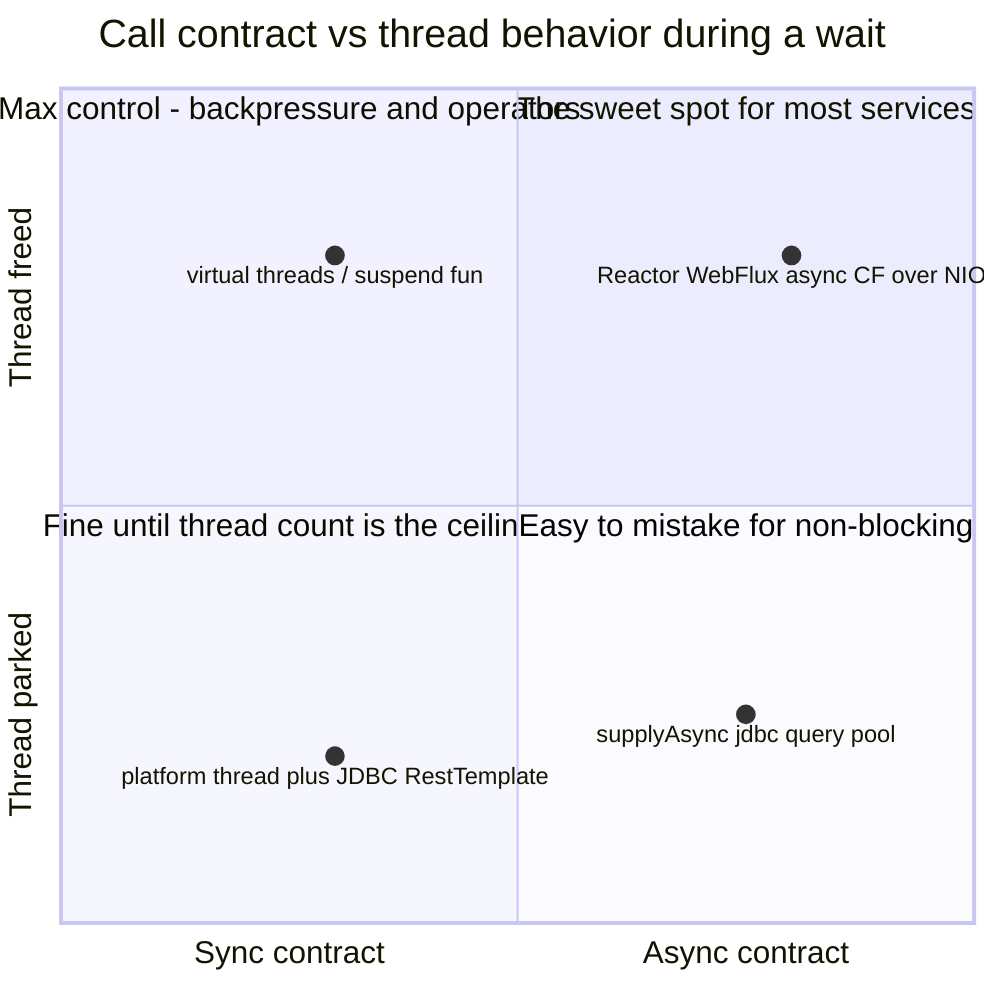
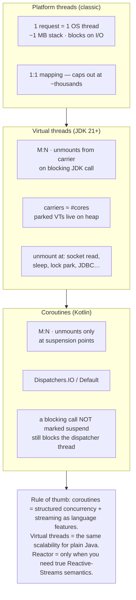
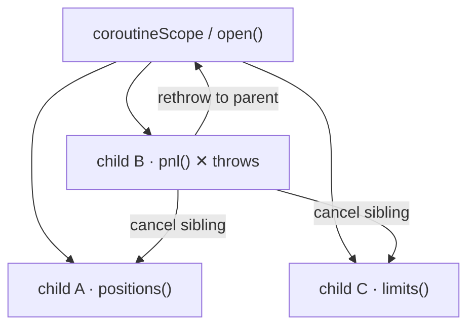
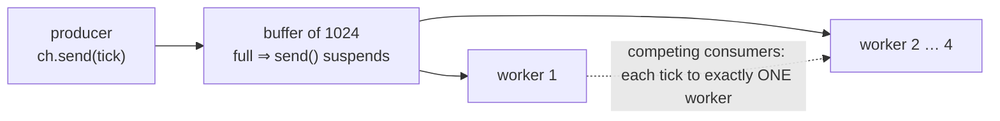
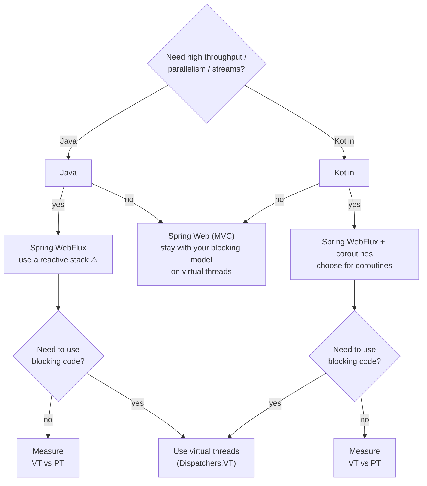

# §0 Mental model

## §0.1Vocabulary: async ≠ parallel ≠ non-blocking

These words get used interchangeably; they name **orthogonal properties**. Every technology in this sheet is a different combination of them — misdiagnosing which property you actually need is how teams end up on WebFlux for a CRUD service.

| Term | A property of… | Meaning | Litmus example |
|---|---|---|---|
| **Blocking / non-blocking** | how the *wait* is implemented | Does an OS thread sit parked inside the call until the result arrives — or is the wait registered with the OS (epoll/NIO) and the thread freed to do other work? | `socket.read()` on a platform thread vs an NIO selector loop |
| **Synchronous / asynchronous** | the *call contract* | Sync: the result is in hand when the call returns. Async: the call returns immediately and the result is delivered later — via callback, future, or resumption. | `Quote quote(id)` vs `CompletableFuture<Quote> quote(id)` |
| **Concurrent** | program *structure* | Multiple tasks in progress over overlapping time windows. Interleaving on a single thread counts — no second core required. | 10k coroutines multiplexed on one dispatcher thread |
| **Parallel** | *hardware* execution | Multiple tasks executing at the same instant on different cores. Parallelism is a subset of concurrency; it buys throughput for CPU-bound work, nothing for waits. | `list.parallelStream().map(…)` |




*fig 0a — contract × wait behavior. Parallelism is a third, independent axis: how many cores execute at once.*

> **THE TRAPS:** **Async ≠ non-blocking**: `supplyAsync` wrapping JDBC is asynchronous to the caller while a pool thread blocks all the same. **Non-blocking ≠ async**: a `suspend fun` or a blocking call on a virtual thread gives a synchronous contract over a freed thread. **Concurrent ≠ parallel**: 100k coroutines can interleave on one thread, while `parallelStream` is parallel yet fully synchronous — the caller waits.

## §0.2Who parks whom

All three models solve the same problem — **don't hold an OS thread hostage during I/O** — at different layers. Coroutines unmount at `suspend` points (compiler-generated state machines, CPS transform). Virtual threads unmount at blocking JDK calls (JVM-managed continuations). Platform threads never unmount; they just block.




*fig 0 — thread mapping. "Parked"/"suspended" work costs a heap object, not an OS thread.*

---

# §1 Suspend functions

`suspend` marks a function that may **pause and resume**. You write it as if it were sequential blocking code; the compiler rewrites it into a state machine. No callbacks, no futures in signatures.

Relationship to coroutines: **a suspend function is not a coroutine.** A coroutine is a running *instance* — created by a builder like `launch`/`async` (§2), owning a `Job` and a context. Suspend functions are the composable *units of work* that execute inside one; they relate to a coroutine roughly as a method relates to the thread executing it. That's why a suspend fn can only be called from a coroutine (or another suspend fn): it needs a coroutine's continuation to suspend against (§1.1). The three Java-side translations below differ radically in ergonomics.

#### KOTLIN · suspend

```kotlin
suspend fun quote(id: String): Quote =
    withContext(Dispatchers.IO) { repo.find(id) }  // blocking JDBC, moved off the CPU pool

suspend fun enrich(id: String): Enriched {
    val q = quote(id)            // thread is RELEASED while this waits
    val r = rating(q.issuer)     // resumes on the SAME dispatcher thread
    return Enriched(q, r)
}
```

> The signature is honest: `suspend` ⇒ may pause. Callable only from a coroutine or another suspend fn — the compiler enforces the "color".

#### JAVA · with virtual threads (JDK 21+)

```java
// Write ordinary blocking code. The VT unmounts during I/O,
// so the OS thread underneath is free to run other work.
Quote quote(String id) { return repo.find(id); }

Enriched enrich(String id) {
    var q = quote(id);           // "blocks" — but only a VT: cheap
    var r = rating(q.issuer());
    return new Enriched(q, r);
}
```

> No function coloring at all — any method may park. The cost: nothing in the signature warns you it does I/O.

#### JAVA · without VT (CompletableFuture)

```java
CompletableFuture<Quote> quote(String id) {
    return CompletableFuture.supplyAsync(() -> repo.find(id), ioPool);
}
CompletableFuture<Enriched> enrich(String id) {
    return quote(id)
        .thenCompose(q -> rating(q.issuer())
            .thenApply(r -> new Enriched(q, r)));  // nested, to keep q in scope
}
```

> Monadic coloring: futures infect every signature, intermediate values force nesting, and stack traces show executor frames instead of your call chain. And a CF is **eager** — work starts the moment `supplyAsync` runs.

#### REACTOR · Mono — the reactive equivalent of one suspend call

```java
Mono<Quote> quote(String id) {
    return Mono.fromCallable(() -> repo.find(id))     // wrap blocking call
               .subscribeOn(Schedulers.boundedElastic()); // ≈ Dispatchers.IO
}
Mono<Enriched> enrich(String id) {
    return quote(id)
        .flatMap(q -> rating(q.issuer())          // == thenCompose
            .map(r -> new Enriched(q, r)));
}   // NOTHING has run yet — a Mono is a lazy recipe; work starts
    // only when the framework (or you) subscribe()s.
```

> The slot mapping: `Mono<T>` ≈ a `suspend () -> T` (one value, lazy, composable) and `Flux<T>` ≈ `Flow<T>` (§7). Same monadic coloring as CompletableFuture, but **lazy** (CF is eager) and with a far richer operator set (`timeout`, `retryWhen`, backpressure). Combining the stacks — calling a Mono from a suspend fn (`awaitSingle()`) or exposing a suspend fn as a Mono (`mono { }`) — is §9.

> **NUANCE:** Coroutine stack traces are synthetic across suspension points; turn on `-Dkotlinx.coroutines.debug` (or IntelliJ's coroutine agent) to recover creation stack traces. Virtual threads keep **true** stack traces — a real observability win.

## §1.1Under the hood: the CPS transform

**CPS = continuation-passing style.** A continuation is "the rest of the computation" reified as an object. Instead of returning a value, a suspend function accepts a `Continuation` and, if it can't finish immediately, returns the marker `COROUTINE_SUSPENDED` and arranges for that continuation to be called later. The Kotlin compiler generates all of this. Below is the same `enrich` from above, as the compiler conceptually emits it.

#### WHAT THE COMPILER EMITS — conceptually, but complete

```java
// ── 1. The state machine. It IS the continuation, and it IS the
//    coroutine's "stack frame" — one small heap object per call.
class EnrichSM extends ContinuationImpl {
    int    label  = 0;      // WHERE to resume (which case of the switch)
    String id;              // ── spilled locals: any variable that must
    Quote  q;               //    survive across a suspension lives here,
    Object result;          //    not on the JVM stack (the stack unwinds!)

    EnrichSM(Continuation<?> caller) { super(caller); }

    // Called by whoever finishes the async work (e.g. the IO dispatcher
    // thread once the JDBC call returns). This is the "callback".
    @Override public void resumeWith(Object value) {
        this.result = value;
        enrich(null, this);   // re-enter the method; switch jumps to `label`
    }
}

// ── 2. The function. Note the signature change: a hidden Continuation
//    parameter, and Object return (either the real value, or the
//    COROUTINE_SUSPENDED marker).
Object enrich(String id, Continuation<Enriched> cont) {

    EnrichSM sm = (cont instanceof EnrichSM e)
        ? e                          // we are being RESUMED: reuse the frame
        : new EnrichSM(cont);        // first call: allocate the frame

    Object result = sm.result;      // whatever resumeWith() handed back

    switch (sm.label) {

        case 0:                                  // ── entry point
            sm.id    = id;                       // spill: needed after resume
            sm.label = 1;                       // "if I'm re-entered, go to case 1"
            result   = quote(id, sm);            // pass sm AS the continuation
            if (result == COROUTINE_SUSPENDED)
                return COROUTINE_SUSPENDED;      // UNWIND. thread is now free.
            // not suspended? quote() had the value ready — fall straight
            // through with zero scheduling overhead (the fast path).

        case 1:                                  // ── resumed after quote()
            Quote q  = (Quote) result;            // value from fall-through OR resumeWith
            sm.q     = q;                        // spill it: needed in case 2
            sm.label = 2;
            result   = rating(q.getIssuer(), sm);
            if (result == COROUTINE_SUSPENDED)
                return COROUTINE_SUSPENDED;

        case 2:                                  // ── resumed after rating()
            Rating r = (Rating) result;
            return new Enriched(sm.q, r);        // the coroutine's return value
    }
    throw new IllegalStateException();
}
```

> Read it as a loop you re-enter: each suspension point is a `case`, `label` is the program counter, and the `sm` fields are the stack frame — on the heap, so the real thread stack can unwind completely. *Simplified:* the real compiler splits this across a separate `invokeSuspend` method (where the switch and spills actually live), and the sentinel is `IntrinsicsKt.getCOROUTINE_SUSPENDED()`. Shown fused for readability.

| Mechanism in the code above | Why it matters |
|---|---|
| Hidden `Continuation` parameter | A caller can only invoke `enrich` if it has a continuation to pass — which is exactly why suspend functions are callable only from suspend contexts. *That* is the function coloring, and it's the whole mechanism. |
| `label` + spilled fields (`id`, `q`) | The coroutine's frame lives on the heap — one small object. A platform thread instead *reserves* up to ~1 MB of stack address space (committed lazily, so resident memory is less), which is what caps you at thousands, not millions. |
| `return COROUTINE_SUSPENDED` | The method returns immediately and the whole Java call stack unwinds, freeing the thread. Nothing is "waiting" anywhere. |
| `resumeWith(value)` re-enters the `switch` | Resumption is just a normal method call from whichever thread completed the work — hence you can resume on a different thread than you suspended on. |
| Fall-through when not suspended | The fast path: if the callee already had the value, no state is saved and no dispatch happens. Suspension is only paid for when it actually occurs. |
| Compile-time rewrite | Only `suspend` calls become suspension points. Loom does the equivalent frame capture at **runtime, in the JVM**, so *any* blocking call can unmount and no signature changes. Same idea, different layer. It's also why coroutine stack traces are synthetic: the real stack unwound, and what remains is a chain of continuation objects. |

## §1.2Do virtual threads make `suspend` obsolete?

Half-true, and the half that's false is the important half. Urs Peter stages exactly this question in his Spring I/O deck — his skeptical Java developer asks whether virtual threads won't simply solve all of these problems — and the slide answers: **"No (only one, to be precise)."** The one problem they solve is thread scarcity on blocking calls. His practical addendum: virtual threads live on the JVM, so every JVM language gets them — and they *complement* coroutines (and reactive frameworks generally) rather than replace them. The honest split:

#### VTs DO replace `suspend` here

```java
// The blocking-I/O-offload use case — suspend's
// original headline job. On a virtual thread:
User loadUser(long id) {
    return jdbc.queryForObject(...);  // just blocks
}   // no suspend, no withContext, no coloring —
    // the VT unmounts its carrier for free.
```

> On JDK 21+ with `spring.threads.virtual.enabled=true`, "don't tie up a thread on I/O" needs no coroutines. VTs win here on **simplicity**: no function coloring, true stack traces, working ThreadLocals/MDC.

#### VTs DON'T touch these — coroutines' real moat

```kotlin
// Structured concurrency as a LANGUAGE feature:
val r = coroutineScope {
    val a = async { svc.x() }      // typed Deferred<T>
    val b = async { svc.y() }      // auto parent-child
    Combined(a.await(), b.await())  // cancel
}                                     //   propagation

// COLD, backpressured async STREAMS — no VT analog:
prices.conflate().map { ... }.collect { ... }
// plus Channel + select, dispatcher confinement,
// cooperative cancellation at suspension points.
```

> `StructuredTaskScope` (§3) is Java's answer to the left block, but it's a preview API and more verbose. There is **no** VT replacement for `Flow`, `Channel`/`select`, or dispatcher confinement — that's a concurrency model, not a threading trick.

#### KOTLIN · on virtual threads, yet `suspend` is still required

```kotlin
// Whole app runs on virtual threads. This service ALSO needs the
// coroutine model — because it returns a STREAM and fans out with
// cancellation. VTs give neither. So suspend stays; it just runs
// ON a VT-backed dispatcher instead of Dispatchers.IO.
//
// NOTE: kotlinx ships NO built-in VT dispatcher. You wrap a virtual-
// thread executor yourself. Urs Peter's slides expose it as an extension
// property, Dispatchers.VT — same mechanism, nicer call-sites. One care:
// extension properties can't have backing fields, so cache the dispatcher
// in a top-level val or every access builds a NEW executor.
private val vtDispatcher: CoroutineDispatcher =
    Executors.newVirtualThreadPerTaskExecutor().asCoroutineDispatcher()
val Dispatchers.VT: CoroutineDispatcher get() = vtDispatcher

// (1) Returns a Flow → MUST be built with a flow builder; there is
//     no virtual-thread way to express a cold, backpressured stream.
fun priceStream(sym: String): Flow<Tick> = flow {
    while (true) emit(poll(sym))        // emit() is a suspend fn
}.conflate().flowOn(Dispatchers.VT)   // blocking poll() on a VT

// (2) Fan-out with a typed result + auto-cancellation → async/await.
//     suspend is mandatory to call coroutineScope / await at all.
suspend fun dashboard(id: String): Dashboard = coroutineScope {
    val pos = async(Dispatchers.VT) { blockingPositions(id) }  // blocking
    val pnl = async(Dispatchers.VT) { blockingPnl(id) }        //   JDBC,
    Dashboard(pos.await(), pnl.await())   // either fails ⇒ sibling cancelled
}                                        //   — a guarantee VTs alone don't give
```

> This is the combination Urs Peter's deck names the *winning formula*: virtual threads *with* coroutines/reactive. His framing of why it wins: with a blocking API you'd otherwise need a separate thread pool with spare blockable threads (`Dispatchers.IO` / `Schedulers.boundedElastic()`) — and that pool can get exhausted and degrade performance. On a VT dispatcher, blocking I/O parks a virtual thread instead of a platform thread, so there is no pool to exhaust. But `Flow`, `async`/`await`, and `coroutineScope` are language constructs you can only reach through `suspend`. VTs are the *execution infrastructure*; coroutines are the *abstraction* — here you want both, so `suspend` stays.

> **TAKEAWAY:** Urs Peter's verdict, which this sheet adopts: **"Loom will not make coroutines obsolete — it completes them."** Post-Loom, "escape the thread-per-request ceiling" is no longer a reason to choose coroutines. What survives is what was always coroutines' own: more mature structured concurrency, finer cancellation hierarchies, automatic context propagation (MDC, security context), and `Flow`. And the two compose exactly as he describes — **let virtual threads execute your coroutines**: wrap a VT executor as a dispatcher (`Executors.newVirtualThreadPerTaskExecutor().asCoroutineDispatcher()` — there is no built-in `Dispatchers.LOOM`) and the dedicated I/O dispatcher for blocking calls disappears, while the orchestration and streaming features remain. The deck adds two boundary conditions worth quoting in code review: on an already fully-async stack (WebClient, R2DBC), virtual threads add *only overhead, no value* — there is nothing blocking for them to fix; and virtual threads have *no API for parallelism* — fan-out needs structured concurrency, which coroutines ship out of the box (`async`/`await`).

---

# §2 Builders & scopes

You can't call a suspend fn from nowhere — a builder creates the coroutine and ties it to a `CoroutineScope` whose `Job` owns its lifecycle. Java's counterpart is an `ExecutorService` — except an executor doesn't propagate cancellation or failure between tasks; that's §3.

| Kotlin | Semantics | Java equivalent |
|---|---|---|
| `runBlocking { }` | Bridge sync→suspend: installs an event loop and *runs* coroutines on the caller thread until done (not merely a park) | Nearest is `CompletableFuture...join()`, but that only parks — it doesn't run a scheduler. No exact analog |
| `scope.launch { }` | Fire-and-manage; returns `Job`, no value | `executor.submit(runnable)` → `Future<?>` |
| `scope.async { }` | Concurrent value; returns `Deferred<T>`, get via `.await()` | `executor.submit(callable)` → `Future<T>.get()`, or `CompletableFuture.supplyAsync` |
| `coroutineScope { }` | Suspend fn that waits for all children; any failure cancels the siblings and rethrows | `StructuredTaskScope.open()` (default all-or-fail policy) — see §3 |
| `supervisorScope { }` | Child failure is isolated — siblings keep running; the scope still joins them | No clean analog: `StructuredTaskScope` (STS) couples the failure policy to the `Joiner`. Closest is a custom `Joiner` that records failures without cancelling (cf. the JEP 525 partial-collector), *not* `awaitAll()` |
| `withContext(ctx) { }` | Switch dispatcher/context for a block, sequential | No direct analog — VT code doesn't switch threads; nearest: submit to another executor and join |
| `GlobalScope.launch` | Unstructured, app-lifetime coroutine — **avoid** | `new Thread(...).start()`, or `@Async` with no configured executor — orphaned work nobody joins or cancels |

> **SPRING:** In Spring, don't hand-roll scopes per request: WebFlux and WebMVC (Framework 6.x) both accept `suspend fun` controller methods and manage the scope for you. For app-lifecycle scopes, create one `CoroutineScope(SupervisorJob() + Dispatchers.Default)` bean and cancel it in `@PreDestroy` — the analog of a Spring-managed `ExecutorService` with `shutdown()`.

---

# §3 Structured concurrency

The core contract: **a concurrent task cannot outlive the block that started it**, failures propagate to the parent, and cancellation propagates to children. Kotlin has had this since 2018; Java is standardizing the same shape via `StructuredTaskScope` (JEP 505, 5th preview in JDK 25 — the JDK 21-era `ShutdownOnFailure` constructors were replaced by `open(Joiner)`). It is **still a preview API**: JDK 26 (JEP 525) renames `anySuccessfulResultOrThrow` → `anySuccessfulOrThrow`, makes `allSuccessfulOrThrow` return a `List`, and adds `Joiner.onTimeout()`. Pin your JDK before depending on the exact spelling.




*fig 1 — failure propagation: one child fails → siblings cancelled → exception rethrown at the join point.*

#### KOTLIN · coroutineScope + async

```kotlin
suspend fun dashboard(id: String): Dashboard = coroutineScope {
    val pos = async { positions(id) }
    val pnl = async { pnl(id) }
    Dashboard(pos.await(), pnl.await())
}   // pnl throws → pos cancelled → exception rethrown here

// race — first success wins, loser cancelled:
suspend fun fastest(): Px = coroutineScope {
    select {
        async { primary() }.onAwait { it }
        async { backup()  }.onAwait { it }
    }.also { coroutineContext.cancelChildren() }
}
```

#### JAVA · StructuredTaskScope (JDK 25, --enable-preview)

```java
Dashboard dashboard(String id) throws Exception {
    try (var scope = StructuredTaskScope.open()) {   // forks run on VTs
        var pos = scope.fork(() -> positions(id));
        var pnl = scope.fork(() -> pnl(id));
        scope.join();          // any failure → cancel siblings, throw
        return new Dashboard(pos.get(), pnl.get());
    }
}
// race:
try (var s = StructuredTaskScope.open(
        Joiner.<Px>anySuccessfulResultOrThrow())) {
    s.fork(() -> primary()); s.fork(() -> backup());
    return s.join();          // first success; loser interrupted
}
// deadline for the whole tree:
// StructuredTaskScope.open(joiner, cf -> cf.withTimeout(ofSeconds(2)))
```

> JDK 21–24 preview spelling: `new StructuredTaskScope.ShutdownOnFailure()` + `scope.join().throwIfFailed()`. Same semantics, older API.

#### JAVA · without virtual threads or StructuredTaskScope

```java
var pos = CompletableFuture.supplyAsync(() -> positions(id), pool);
var pnl = CompletableFuture.supplyAsync(() -> pnl(id), pool);
try {
    CompletableFuture.allOf(pos, pnl).join();
} catch (CompletionException e) {
    pos.cancel(true); pnl.cancel(true);   // manual, and…
    // …cancel(true) does NOT interrupt a running supplyAsync task!
    throw e;
}
```

> No parent–child relationship, no automatic sibling cancellation, no scoping of lifetimes. This is exactly the gap JEP 505 and coroutines both close.

---

# §4 Dispatchers ↔ Executors

A `CoroutineDispatcher` is literally an executor with coroutine plumbing (`asCoroutineDispatcher()` / `asExecutor()` convert both ways).

| Kotlin dispatcher | Sized for | Java executor analog |
|---|---|---|
| `Dispatchers.Default` | CPU-bound · threads = #cores | `ForkJoinPool.commonPool()` / fixed pool of #cores |
| `Dispatchers.IO` | Blocking I/O · elastic, up to 64 threads (or #cores if larger), created on demand · shares one pool with Default (a blocking-flag is the only distinction) | `newCachedThreadPool()` — or with Loom: `newVirtualThreadPerTaskExecutor()`, which makes the whole distinction obsolete |
| `Dispatchers.IO.limitedParallelism(n)` | A view that **bypasses** the 64 cap — genuinely n threads, additive across views. This is the modern replacement for `newFixedThreadPoolContext(n)` | `Semaphore(n)` around submits, or a fixed pool of n |
| `Dispatchers.Unconfined` | Resume on whatever thread resumed you (tests, edge cases) | Caller-runs / same-thread executor (`Runnable::run`) |
| `Dispatchers.Loom`-style: `Executors.newVirtualThreadPerTaskExecutor().asCoroutineDispatcher()` | Run coroutines on VTs — lets blocking calls inside coroutines park cheaply | — (that *is* the Java side) |

> **SIZING:** `Dispatchers.IO`'s 64-thread default is a classic prod ceiling (raise via `kotlinx.coroutines.io.parallelism`). Virtual threads have no pool to exhaust — but your **JDBC pool** becomes the new bottleneck either way. Keep Hikari sized deliberately; a million VTs queueing on 10 connections is still 10-wide.

---

# §5 Cancellation & timeouts

Both models are **cooperative** — nothing dies mid-instruction. Coroutines check at suspension points; Java threads check at interruption-aware calls. The failure modes are symmetric: a tight CPU loop ignores both.

| Kotlin | Java (threads / VT) | Watch out |
|---|---|---|
| `job.cancel()` → `CancellationException` at next suspension point | `thread.interrupt()` → `InterruptedException` at next blocking call | CPU loops: poll `isActive`/`ensureActive()` ↔ `Thread.interrupted()` |
| `withTimeout(2.seconds) { }` / `withTimeoutOrNull` | `StructuredTaskScope` deadline: `open(joiner, cf -> cf.withTimeout(ofSeconds(2)))` — cancels the whole task tree · `future.get(2, SECONDS)` · `orTimeout()` | `orTimeout` completes the CF but doesn't stop the underlying work |
| `withContext(NonCancellable) { cleanup() }` | `finally` block (interrupt flag survives; re-set it if you swallow) | Never call suspend fns in `finally` without `NonCancellable` — the coroutine is already cancelled |
| `CancellationException` is "normal" — never swallow it in a broad `catch (e: Exception)` without rethrowing | Same sin: `catch (InterruptedException e) {}` — restore via `Thread.currentThread().interrupt()` | Both silently break structured cancellation upstream |

> **THE STS TRAP:** `StructuredTaskScope` cancellation is delivered **as an interrupt**. A subtask that never blocks at an interruptible point — a tight CPU loop, or uninterruptible native I/O — will not notice, and `scope.close()` (the implicit end of the try-with-resources) will **block indefinitely** waiting for it. Same shape as a coroutine that never hits a suspension point, but the consequence is worse: the scope can't exit. In CPU loops, poll `Thread.currentThread().isInterrupted()`.

---

# §6 Channels — handing work between coroutines

A `Channel<T>` is a queue whose `send`/`receive` **suspend** instead of blocking. Suspension on a full buffer *is* the backpressure mechanism — no operators required.

> **THE GOAL:** All three versions below build the **same pipeline**: one producer reads a market-data feed, a bounded buffer of 1024 sits in the middle, and 4 workers index ticks in parallel. Each tick must be handled by **exactly one** worker, and if the workers fall behind, the producer must be slowed down rather than the buffer growing without bound.




*fig 2 — suspension IS the backpressure. Nothing is polled, nothing is dropped.*

#### KOTLIN · the complete pipeline

```kotlin
suspend fun indexFeed(feed: Flow<Tick>) = coroutineScope {

    val ch = Channel<Tick>(capacity = 1024)      // the bounded buffer

    // ── PRODUCER ────────────────────────────────────────────────
    launch {
        try {
            feed.collect { tick ->
                ch.send(tick)      // SUSPENDS while the buffer is full.
            }                     // The thread is released; the producer
        } finally {             // simply stops pulling from the feed.
            ch.close()           // broadcasts "no more items" to ALL workers
        }
    }

    // ── 4 WORKERS, all receiving from the SAME channel ──────────
    repeat(4) {
        launch {
            for (tick in ch) {    // suspends while empty; each tick is
                index(tick)         // delivered to exactly ONE worker
            }                     // loop exits cleanly once ch is closed AND drained
        }
    }
    // coroutineScope waits here for the producer + all 4 workers.
    // If any of them throws, the others are cancelled (see §3).
}
```

> Three things do real work here: `send` suspending gives backpressure for free, `close()` is a first-class end-of-stream signal that terminates every consumer's `for` loop, and `coroutineScope` guarantees no worker outlives the function.

#### JAVA · the same pipeline, on virtual threads

```java
// The translation is mechanical:
//   Channel(1024)  ->  ArrayBlockingQueue(1024)
//   send / receive ->  put / take   (BLOCK instead of suspend)
//   close()        ->  a "poison pill" sentinel  (no built-in equivalent)
// On virtual threads, a blocked put/take unmounts the carrier —
// so blocking here costs about what suspending costs in Kotlin.

void indexFeed(Iterable<Tick> feed) throws InterruptedException {

    var queue  = new ArrayBlockingQueue<Tick>(1024);
    final Tick POISON = Tick.SENTINEL;   // stands in for close()

    try (var exec = Executors.newVirtualThreadPerTaskExecutor()) {

        // ── PRODUCER ────────────────────────────────────────────
        exec.submit(() -> {
            for (Tick t : feed) {
                queue.put(t);      // BLOCKS while full — but only a virtual
            }                     // thread parks, so this IS backpressure
            for (int i = 0; i < 4; i++)
                queue.put(POISON);  // one pill per worker, so each one exits
            return null;
        });

        // ── 4 WORKERS ───────────────────────────────────────────
        for (int i = 0; i < 4; i++) {
            exec.submit(() -> {
                while (true) {
                    Tick t = queue.take();   // parks while empty; one tick,
                    if (t == POISON) return null;  // one worker
                    index(t);
                }
            });
        }
    }  // close() on the executor waits for producer + all workers
}
```

> What's genuinely missing versus Kotlin: a real `close()` (hence the pill), `select` over several queues, and conflation. What you gain: plain, debuggable, thread-per-task code with true stack traces.

#### JAVA · the same pipeline, pre-Loom

```java
// The SAME BlockingQueue code still compiles and runs. The problem
// is cost: every parked producer/consumer holds a PLATFORM thread
// (~1 MB of stack). A few hundred pipelines and you are out of
// threads long before you are out of CPU.
//
// The reactive answer inverts the design: NOBODY waits. Instead of
// a consumer blocking on take(), the producer PUSHES items to
// subscribers, and demand travels back upstream as a protocol
// (Subscription.request(n)) rather than as a parked thread.
//
// A "Sink" is Reactor's push-end of a stream: the object you call
// from ordinary imperative code to feed items INTO a Flux.

Sinks.Many<Tick> sink = Sinks.many()
        .multicast()                    // one stream, many subscribers
        .onBackpressureBuffer(1024);    // the bounded buffer

// ── PRODUCER: called from wherever the feed already lives ──
void onTick(Tick t) {
    Sinks.EmitResult res = sink.tryEmitNext(t);  // returns IMMEDIATELY
    if (res.isFailure()) {          // buffer full / no demand:
        metrics.dropped();          // there is no thread to park, so YOU
    }                              // must choose: drop, retry, or fail
}

// ── 4 WORKERS: .parallel(4) splits the stream into 4 "rails",
//    each element going to exactly one rail — the competing-
//    consumers behaviour a Channel gives you by default.
sink.asFlux()
    .parallel(4)
    .runOn(Schedulers.parallel())
    .subscribe(this::index);
```

> Note the semantic trap: a plain `multicast()` Flux **broadcasts** every element to every subscriber — unlike a Channel, where each element goes to one consumer. `.parallel(n)` is what restores work-distribution. And backpressure is no longer automatic: `tryEmitNext` can fail and you must handle it.

#### KOTLIN · `select` — waiting on several channels at once (no JDK equivalent)

```kotlin
// Take whichever arrives FIRST, from any of several sources,
// with a timeout as just another branch. In Java you would hand-roll
// this with a shared queue, a poller, or CompletableFuture.anyOf.
while (isActive) {
    select<Unit> {
        ticks.onReceive  { t -> handleTick(t) }     // a tick arrived first
        orders.onReceive { o -> handleOrder(o) }    // an order arrived first
        onTimeout(500.milliseconds) { heartbeat() }  // nothing arrived at all
    }
}
```

---

# §7 Flow ↔ Reactor — asynchronous streams

A `Flow<T>` is a **cold, suspending stream**: a recipe that produces values over time. Nothing runs until you collect it, each collector gets its own fresh run, and backpressure is implicit — a slow collector simply suspends the emitter. `Flux<T>` occupies the same conceptual slot in Reactor.

`java.util.stream.Stream` is *not* an equivalent: it's synchronous, pull-only, single-use, and has no notion of time. And `java.util.concurrent.Flow` (JEP 266) is only the Reactive-Streams *interfaces* — the JDK ships zero operators; Reactor and RxJava supply them.

## §7.0Channel vs Flow — and `channelFlow`, the bridge

§6 was `Channel`; this section is `Flow`. They are easy to confuse because both carry a sequence of values over time — but they sit on opposite sides of one line: **a channel is *hot* and shared; a flow is *cold* and per-collector.** Getting this distinction is what makes `channelFlow` (used heavily in §11) obvious rather than mysterious.

|  | `Channel<T>` (§6) | `Flow<T>` (§7) |
|---|---|---|
| **Hot or cold** | HOT — exists and buffers whether or not anyone is reading | COLD — inert until `collect`; the body re-runs for *each* collector |
| **Who produces** | One side `send`s, another `receive`s — **decoupled**, often different coroutines | The `flow { }` block *is* the producer; it runs inside the collector |
| **Fan-out** | Each item goes to **exactly one** receiver (competing consumers) | Each collector gets **its own independent run** of every item |
| **Concurrency inside** | Naturally multi-producer / multi-consumer | Sequential by default — you can't `emit` from another coroutine |
| **Reuse** | Single conduit; once closed, done | Re-collectable any number of times |
| **Java analogy** | `BlockingQueue` — a live pipe between threads | A lazy `Supplier`-of-stream — nothing until someone iterates |

Rule of thumb: reach for a **Channel** when independent producers must hand work to consumers (a pipeline, §6). Reach for a **Flow** when you're describing a reusable stream a caller will consume (an API return type, §7). The tension appears when you want a Flow's cold, backpressured, re-collectable *interface* but need several coroutines producing into it concurrently — which a plain `flow { }` forbids.

#### KOTLIN · `channelFlow` — a Flow whose values come from a Channel

```kotlin
// A plain flow { } is sequential: you may only emit() from the
// flow's own coroutine. The naive attempts both fail:
//   flow { launch { emit(x) } }                  // doesn't COMPILE —
//     the flow block has no CoroutineScope, so launch doesn't resolve
//   flow { coroutineScope { launch { emit(x) } } }  // compiles, then
//     throws at RUNTIME: "Flow invariant is violated" (concurrent emit)

// channelFlow gives the block a hidden Channel. Concurrent children
// send() into it; channelFlow drains it and emits downstream. To the
// COLLECTOR it's an ordinary cold Flow with normal backpressure —
// the channel is an internal implementation detail.
fun prices(syms: List<String>): Flow<Tick> = channelFlow {
    syms.forEach { sym ->
        launch {                       // one child coroutine per symbol —
            feed(sym).collect { send(it) }  // all producing CONCURRENTLY
        }
    }
}   // closes when every child completes (structured concurrency)

// send() suspends when the downstream collector is slow → the cold
// Flow's backpressure reaches all the way back to each producer.
```

> So: `flow { }` = cold + sequential producer. `Channel` = hot + concurrent, but not a Flow. `channelFlow { }` = the bridge — a cold Flow on the outside, a concurrent Channel on the inside. That is exactly the fan-in shape §11.1 needs: several backends producing into one streamed response. (`callbackFlow` is the same tool for bridging a callback-based API into a Flow.)

> **THE GOAL:** Both snippets below build the **same live price feed** for one symbol: poll the source repeatedly, normalise each tick, discard bad prices, keep going if the source errors (substituting a stale marker, retrying up to 3×), and decouple the producer from a slow consumer with a 256-element buffer so a slow subscriber can't stall the poll loop.

#### KOTLIN · Flow

```kotlin
fun ticks(sym: String): Flow<Tick> = flow {   // COLD: this block re-runs
    while (currentCoroutineContext().isActive) {  //   for each collector
        emit(poll(sym))                  // emit() can suspend — no callbacks
    }
}
.map { normalize(it) }                  // transform each tick
.filter { it.px > 0 }                  // drop bad prices
.buffer(256)                            // run producer + consumer concurrently,
                                        //   with 256 slots between them
.flowOn(Dispatchers.IO)                 // everything ABOVE this line runs on IO
.catch { e -> emit(Tick.stale(sym)) }   // upstream failed: substitute a value
.retry(3)                              // ...or just re-run the whole flow, 3×

// TERMINAL: nothing above has run yet. collect() starts it and
// SUSPENDS the caller until the flow completes.
ticks("AAPL").collect { publish(it) }
```

#### REACTOR · Flux

```java
Flux<Tick> ticks(String sym) {
    return Flux.<Tick>generate(s -> s.next(poll(sym)))  // COLD too
        .map(this::normalize)               // same
        .filter(t -> t.px() > 0)             // same
        .onBackpressureBuffer(256)          // == buffer(256)
        .subscribeOn(Schedulers.boundedElastic())  // == flowOn(IO)
        .onErrorResume(e -> Flux.just(Tick.stale(sym)))  // == catch{}
        .retry(3);
}

// TERMINAL: subscribe() starts it and RETURNS IMMEDIATELY.
// The work happens on a scheduler thread; results arrive by callback.
ticks("AAPL").subscribe(this::publish);
```

> The one deep difference: `collect` **suspends the caller** — you stay in sequential code and can wrap the whole thing in try/catch. `subscribe` **detaches** — you're in callback land, and errors must be routed through operators. Reactor's demand signal (`request(n)`) is an explicit protocol that can cross a network boundary (RSocket); Kotlin's suspension cannot — it's in-process only.

## §7.1The operators that actually cause bugs

Names alone don't help. These four groups are where people get it wrong; each marble diagram reads left→right as time, and each row is one stream.

**Source stream:** `A` at t=1, `B` at t=3 (each opens an inner stream: A → a1, a2, a3; B → b1, b2)

| Operator | Emission order | Behavior |
|---|---|---|
| `flatMapMerge` (Flow) / `flatMap` (Reactor) | a1, a2, b1, a3, b2 | Interleaved — order NOT preserved, inner streams run concurrently |
| `flatMapConcat` (Flow) / `concatMap` (Reactor) | a1, a2, a3, b1, b2 | B waits for A to finish — order preserved, no concurrency |
| `flatMapLatest` (Flow) / `switchMap` (Reactor) | a1, a2, b1, b2 (a3 dropped) | B's arrival CANCELS A's inner stream — a3 never emitted (search-as-you-type pattern) |


*fig 2a — the same source, three flattening strategies. Picking the wrong one is the classic reactive bug.*

**Source stream:** emits 1, 2, 3, 4, 5, 6 — consumer is slower than the producer.

| Strategy | Emitted | Behavior |
|---|---|---|
| `buffer(n)` | 1, 2, 3, 4, 5, 6 (delayed) | Keep EVERYTHING, deliver late — full buffer ⇒ producer suspends |
| `conflate()` | 1, 3, 5, 6 | Skip stale values, keep only the LATEST |
| `debounce(t)` | 3, 5, 6 | Emit only after a period of SILENCE |
| `sample(t)` | 3, 5, 6 | Emit the latest value on a fixed CLOCK tick |


*fig 2b — `debounce` waits for the typing to stop; `sample` ticks on a timer regardless. They are not interchangeable.*

The full mapping, with what each operator actually does:

| Kotlin Flow | Reactor | What it does |
|---|---|---|
| `map { }` / `filter { }` | `map` / `filter` | Transform each element / drop the ones failing a predicate. 1-to-1 and 1-to-0. |
| `flatMapMerge` | `flatMap` | Each element opens an inner stream; run them **concurrently** and interleave the results. Fastest, order not preserved. *Use for: fan-out calls per element.* |
| `flatMapConcat` | `concatMap` | Same, but each inner stream must **finish before the next starts**. Order preserved, no concurrency. *Use when order matters.* |
| `flatMapLatest` | `switchMap` | **Cancels** the in-flight inner stream when a new element arrives. *Use for: search-as-you-type, "only the newest request counts".* |
| `zip` | `zip` | Pair up the **1st with the 1st, 2nd with the 2nd**. Waits for both sides; a fast stream is throttled by a slow one. |
| `combine` | `combineLatest` | Re-emit whenever **either** side changes, using the latest of the other. *Use for: live dashboards ("price × qty").* |
| `buffer(n)` | `onBackpressureBuffer(n)` | Let producer and consumer run concurrently with n slots between them. Keeps everything; full buffer ⇒ producer suspends. |
| `conflate()` | `onBackpressureLatest()` | Drop intermediate values; the consumer always gets the **newest**. *Use for: prices, positions, any "current state".* |
| `debounce(t)` | `debounce` / `sampleTimeout` | Emit only after **t of silence**. Bursts collapse to their last element. |
| `sample(t)` | `sample(t)` | Emit the latest value **every t**, on a clock. Steady output rate regardless of input rate. |
| `onEach` / `onCompletion` | `doOnNext` / `doFinally` | Side effects (logging, metrics) without changing the stream. |
| `catch { }` / `retry(n)` | `onErrorResume` / `retryWhen(Retry.backoff(..))` | Substitute a fallback stream on failure / re-subscribe from scratch, up to n times. |
| `flowOn(ctx)` — affects everything UPSTREAM of it | `subscribeOn` (the source) + `publishOn` (everything downstream) | Choose which threads run which part of the chain. Kotlin has one operator with one direction; Reactor has two with opposite effects — a frequent source of confusion. |
| `first()` / `toList()` / `collect { }` | `next()` / `collectList()` / `subscribe()` | Terminal operators — these are what actually start the stream. |

---

# §8 Hot streams: StateFlow / SharedFlow ↔ Sinks

Cold streams restart per collector; hot streams broadcast one live sequence to all. Kotlin splits the hot case into two purpose-built types instead of Reactor's `Sinks`/`ConnectableFlux` matrix.

| Kotlin | Semantics | Reactor | Plain Java |
|---|---|---|---|
| `MutableStateFlow(initial)` | Always has a value · conflated · new collectors get current value · `.value` readable synchronously | `Sinks.many().replay().latest()` or `Flux.cache(1)` | `volatile` field + listener list (what you'd hand-roll) |
| `MutableSharedFlow(replay=n, extraBufferCapacity=…)` | Broadcast events · configurable replay · slow-collector policy (`SUSPEND`/`DROP_OLDEST`/`DROP_LATEST`) | `Sinks.many().multicast().onBackpressureBuffer()` / `.replay().limit(n)` | `SubmissionPublisher` (JDK — the one operator-less publisher it ships) |
| `flow.shareIn(scope, WhileSubscribed(), replay)` / `stateIn(...)` | Cold→hot promotion with lifecycle | `flux.publish().refCount()` / `replay(1).refCount()` | n/a |

> **PATTERN:** For a "latest snapshot" cache (config, reference data, last quote per key): `StateFlow` beats a channel — reads are free (`.value`), writers conflate, collectors observe changes. Java analog on VT: `AtomicReference` + a condition/phaser for wakeups, or just poll.

---

# §9 Interop bridges — mix stacks without rewriting

You rarely choose one model wholesale. These adapters make Reactor libraries (WebClient, R2DBC, Kafka Reactor) feel native from coroutines, and vice versa.

#### KOTLIN ⇢ consuming Java async APIs

```kotlin
// kotlinx-coroutines-reactor:
val user: User = webClient.get().uri("/u/{id}", id)
    .retrieve().bodyToMono<User>()
    .awaitSingle()                    // Mono<T> → suspend

val events: Flow<Event> = flux.asFlow()   // Flux<T> → Flow<T>

// kotlinx-coroutines-jdk8:
val px: Px = completableFuture.await()      // CF<T> → suspend

// blocking Java API (JDBC, Solr client…):
val docs = withContext(Dispatchers.IO) { solr.query(q) }
```

#### JAVA ⇠ consuming Kotlin suspend APIs

```java
// expose suspend fn to Java as Reactor types:
fun enrichMono(id: String): Mono<Enriched> =
    mono { enrich(id) }               // builder from -reactor

fun ticksFlux(): Flux<Tick> = ticks("AAPL").asFlux()

// or as a CompletableFuture (kotlinx-coroutines-jdk8):
fun enrichCf(id: String): CompletableFuture<Enriched> =
    scope.future { enrich(id) }
```

> Dependency map: `kotlinx-coroutines-reactor` (Mono/Flux ⇄ suspend/Flow, incl. Reactor context propagation), `-jdk8` (CompletableFuture), `-reactive` (raw Reactive Streams `Publisher`).

---

# §10 WebMVC vs WebFlux — the post-Loom decision

Before Loom, WebFlux's core selling point was escaping the thread-per-request ceiling. **Virtual threads erase that argument** — the framing this section follows is Urs Peter's (§13). What remains is *semantics*: Reactive-Streams backpressure as a real protocol, streaming operator composition, and an ecosystem that is non-blocking all the way down. If you don't need those, WebMVC + VT is the simpler system — true stack traces, working ThreadLocals/MDC, plain JDBC, ordinary debugging.




*fig 3 — **Urs Peter's decision tree**, redrawn from his "Adding Virtual Threads" webinar (§13). Language first, workload second, then "do I need blocking code?" — with virtual threads as the answer either way: the default runtime for the blocking model (green), or the escape hatch inside a reactive/coroutine stack (yellow — exactly the `Dispatchers.VT` winning formula of §1.2). Both branches end in **Measure VT vs PT**: he tells you to benchmark, not assume. The green box is one property away — `spring.threads.virtual.enabled=true` (Boot 3.2+, JDK 21+); on WebFlux that same property generally makes no difference, since event-loop threads don't block. His rule of thumb: for many low-load applications the blocking model on virtual threads is sufficient; fine-grained parallelism or advanced streaming is where WebFlux + coroutines remains the superior choice.*

| Scenario | Verdict | Why |
|---|---|---|
| CRUD / REST over JDBC or JPA (the median service) | WebMVC + VT | JDBC blocks; on virtual threads that's fine. R2DBC buys complexity, not throughput, once threads are cheap. |
| API aggregator — 10 downstream calls per request | WebMVC + VT, fan out with StructuredTaskScope | Per-request concurrency is structured concurrency's job, not the web stack's. |
| SSE / WebSocket push, moderate subscriber counts | WebMVC + VT suffices | MVC supports SSE (`SseEmitter`, or return a `Flux`/`Flow` on Spring 6). One parked VT per connection is cheap. |
| Market-data streaming: per-subscriber flow control, windowing, conflation, 100k+ connections | WebFlux | You need the `request(n)` protocol and the operator algebra end to end. |
| API gateway / proxy | WebFlux | Spring Cloud Gateway is built on it; streams bytes without buffering whole bodies. |
| RSocket, reactor-kafka, an existing R2DBC estate | WebFlux | Backpressure must cross a process boundary. Suspension can't — it's in-process only. |
| Kotlin team that wants streaming without Reactor's operator soup | Either stack + coroutines | `suspend` controllers and `Flow` return types work on WebFlux (since 5.2) and WebMVC (since Framework 6). Spring Data adds `CoroutineCrudRepository`: suspend query methods with *nullable* returns (`suspend fun findByUserName(n: String): User?`) instead of `Mono`-wrapped ones — the `Mono` abstraction disappears at the repository too. |

## §10.1The same endpoint, four ways

A dashboard endpoint that fans out to two downstream services and joins the results — written for each stack, in both languages.

#### JAVA · WebMVC + virtual threads

```java
# application.yaml
spring.threads.virtual.enabled: true   # Tomcat, @Async, listeners → VTs
```

```java
@RestController
class DashController {
    private final DashService svc;

    @GetMapping("/dash/{id}")
    Dashboard dash(@PathVariable String id) throws Exception {
        // Blocking signature. Blocking body. Ordinary try/catch.
        // The request runs on a virtual thread, so the two calls below
        // park without holding an OS thread.
        try (var scope = StructuredTaskScope.open()) {
            var pos = scope.fork(() -> svc.positions(id));
            var pnl = scope.fork(() -> svc.pnl(id));
            scope.join();     // either fails ⇒ the other is cancelled
            return new Dashboard(pos.get(), pnl.get());
        }
    }
}
```

> Plain JDBC inside `svc`. MDC works. The stack trace names your methods. This is the default choice.

#### JAVA · WebFlux + Reactor

```java
@RestController
class DashController {
    private final DashService svc;   // must return Mono/Flux all the way down

    @GetMapping("/dash/{id}")
    Mono<Dashboard> dash(@PathVariable String id) {
        // The method RETURNS a recipe; nothing has run yet. Whoever
        // subscribes (the framework) starts it on an event-loop thread.
        return Mono.zip(                  // run both, wait for both
                svc.positions(id),        // Mono<Positions>
                svc.pnl(id))               // Mono<Pnl>
            .map(t -> new Dashboard(t.getT1(), t.getT2()))
            .timeout(Duration.ofSeconds(2))
            .onErrorResume(TimeoutException.class,
                           e -> Mono.just(Dashboard.degraded()));
    }
}
// SSE streaming endpoint — this is what WebFlux is actually for:
@GetMapping(value = "/ticks/{sym}", produces = TEXT_EVENT_STREAM_VALUE)
Flux<Tick> stream(@PathVariable String sym) {
    return marketData.ticks(sym)
        .onBackpressureLatest()          // slow client? keep only the newest
        .sample(Duration.ofMillis(250));  // throttle, per subscriber
}
```

> **Never block an event-loop thread** — Netty runs roughly #cores of them, and one blocking call stalls thousands of requests. Put BlockHound in your test suite. For ThreadLocal/MDC/tracing across suspension points, **Spring Boot 4 / Framework 7** add automatic coroutine context propagation: set `spring.reactor.context-propagation=auto` (with `io.micrometer:context-propagation`, bundled in Boot 4) and traceIds flow into suspend functions out of the box.

#### KOTLIN · WebMVC + VT (or WebFlux — the code is identical)

```kotlin
@RestController
class DashController(val svc: DashService) {

    @GetMapping("/dash/{id}")
    suspend fun dash(@PathVariable id: String): Dashboard =
        coroutineScope {
            val pos = async { svc.positions(id) }
            val pnl = async { svc.pnl(id) }
            Dashboard(pos.await(), pnl.await())
        }   // either throws ⇒ the sibling is cancelled, exception propagates
}
```

> Spring runs the coroutine for you and manages the scope. The exact same source compiles on **both** stacks — only the runtime underneath differs.

#### KOTLIN · WebFlux streaming (Flow instead of Flux)

```kotlin
@GetMapping("/ticks/{sym}", produces = [TEXT_EVENT_STREAM_VALUE])
fun stream(@PathVariable sym: String): Flow<Tick> =
    marketData.ticks(sym)
        .conflate()                    // == onBackpressureLatest()
        .sample(250.milliseconds)      // == sample(ofMillis(250))

// Reactive runtime, imperative-looking code. This is the sweet spot
// when you genuinely need WebFlux but don't want the operator soup:
// use Flow at the edges, and awaitSingle()/asFlow() to bridge (see §9).
```

> Returning a `Flow` from a WebFlux controller works out of the box — Spring adapts it to a `Publisher`.

---

# §11 Server pipeline patterns

Six patterns for high-throughput request pipelines — the shapes behind streaming APIs and fan-out backends (as catalogued in Bowen Feng's *"Concurrency Patterns for Modern High Performance Kotlin Servers"*) — each with its Java translation. They compose: a real endpoint is typically a generator over a fan-in, with hedged calls, timeouts at two granularities, and backpressure at the edge.

| Pattern | Problem it solves | Kotlin | Java |
|---|---|---|---|
| **Generator** | Cut time-to-first-byte: emit results as they're ready, not when everything is done | function returning `Flow` | `Flux` / SSE; MVC: `SseEmitter` on a VT |
| **Fan-in** | Run N independent calls in parallel, merge into one stream | producers → one `Channel`; or `merge()` / `flatMapMerge` | VTs → one `BlockingQueue`; or `Flux.merge` |
| **Ordering** | Concurrent results arrive out of order | server-side: `awaitAll()` · client-side: sequence numbers | ordered `fork` list + `join` · same seq-number scheme |
| **Timeout control** | A slow backend must not hang the request | `withTimeout`, coarse and fine | scope deadline (`StructuredTaskScope`) · `orTimeout` · Reactor `.timeout` |
| **Hedging** | Tail latency: p99 dominated by one slow replica | race two `async`, first wins, loser cancelled | `Joiner.anySuccessfulResultOrThrow()` (JDK 26: `anySuccessfulOrThrow`) · `Mono.firstWithValue` |
| **Backpressure** | A slow client must be able to slow the server | built into `Flow`; `buffer(n)` to stay ahead | Reactive-Streams `request(n)`; MVC+VT: the blocking socket write *is* the backpressure |

## §11.1Generator + fan-in — the streaming aggregator

> **THE GOAL:** An endpoint calls three independent backends (or tools, or RPCs) and streams each result to the client **the moment it arrives**. Total latency ≈ max(backends), not sum(backends) — and the client's time-to-first-byte ≈ min(backends).

#### KOTLIN · channelFlow (fan-in) returned as a Flow (generator) — see §7.0

```kotlin
// GENERATOR: the return type is a Flow — the framework streams it
// (SSE / chunked) instead of buffering a full response.
fun answers(q: Query): Flow<Part> = channelFlow {
    // FAN-IN: three child coroutines send into ONE implicit channel.
    launch { send(search(q))  }        // each send() happens as soon as
    launch { send(ratings(q)) }        //   that backend responds —
    launch { send(news(q))    }        //   arrival order, not call order
}   // channelFlow closes when all three children complete (structured!)

// Same shape with operators, when the sources are already Flows:
val merged: Flow<Part> = merge(searchF, ratingsF, newsF)
// flatMapMerge = fan-in over a DYNAMIC set of inner flows (§7.1);
// flatMapConcat = same, but strictly sequential emission.
```

#### JAVA · MVC + virtual threads

```java
@GetMapping("/answers")
SseEmitter answers(Query q) {
    var sse  = new SseEmitter(30_000L);
    var exec = Executors.newVirtualThreadPerTaskExecutor();
    var left = new AtomicInteger(3);
    var done = new AtomicBoolean(false);   // single-completion guard

    // MUST shut the executor down, or you leak one per request.
    // Can't use try-with-resources: close() blocks; return now.
    sse.onCompletion(exec::shutdownNow);   // fires on complete OR error
    sse.onTimeout(() -> finish(sse, done, null));

    for (Supplier<Part> call :
            List.of(() -> search(q), () -> ratings(q), () -> news(q))) {
        exec.submit(() -> {              // FAN-IN: 3 VTs, one emitter
            try {
                sse.send(call.get());        // GENERATOR: flush per result
                if (left.decrementAndGet() == 0) finish(sse, done, null);
            } catch (Exception e) {
                finish(sse, done, e);    // end the stream on any failure
            }
            return null;
        });
    }
    return sse;
}

// Complete AT MOST ONCE. Two subtasks failing near-simultaneously
// would otherwise both call complete*/(), and the 2nd throws
// IllegalStateException ("already completed") silently inside a VT.
private static void finish(SseEmitter sse, AtomicBoolean done, Exception err) {
    if (!done.compareAndSet(false, true)) return;   // someone already ended it
    if (err == null) sse.complete(); else sse.completeWithError(err);
}
```

> Three bugs this shape invites: **leaking the executor** (nothing closes it — hence `onCompletion`), **hanging the client** when a subtask throws and the countdown never reaches zero, and — subtlest — **double completion**: two near-simultaneous failures both calling `completeWithError`, the second throwing `IllegalStateException` unobserved inside a VT. The `AtomicBoolean` serialises it. Contrast `channelFlow`, where completion and cancellation are structural and none of the three is expressible.

#### JAVA · WebFlux

```java
@GetMapping(value = "/answers", produces = TEXT_EVENT_STREAM_VALUE)
Flux<Part> answers(Query q) {
    return Flux.merge(          // FAN-IN, arrival order
        search(q), ratings(q), news(q));  // each a Mono<Part>
}   // the Flux return type IS the generator
```

## §11.2Ordering — when the merge must not shuffle

#### KOTLIN · server-side vs client-side ordering

```kotlin
// SERVER-SIDE: run concurrently, deliver in ORIGINAL order.
// awaitAll preserves list order regardless of completion order —
// simple, but the client waits for the slowest item before item 1.
suspend fun enrichAll(ids: List<Id>): List<Doc> = coroutineScope {
    ids.map { async { enrich(it) } }.awaitAll()
}

// CLIENT-SIDE: stream in ARRIVAL order, tagged with a sequence
// number; the client reassembles. Best time-to-first-byte.
data class Chunk(val seq: Int, val doc: Doc)
fun enrichStream(ids: List<Id>): Flow<Chunk> = channelFlow {
    ids.forEachIndexed { i, id ->
        launch { send(Chunk(seq = i, doc = enrich(id))) }
    }
}
```

#### JAVA · the same two choices

```java
// SERVER-SIDE: fork in order, get() in order. Completion order
// is irrelevant — the subtask LIST carries the sequence.
List<Doc> enrichAll(List<Id> ids) throws Exception {
    try (var scope = StructuredTaskScope.open()) {
        var tasks = ids.stream()
            .map(id -> scope.fork(() -> enrich(id)))
            .toList();
        scope.join();
        return tasks.stream().map(Subtask::get).toList();  // get() only valid AFTER join()
    }
}

// CLIENT-SIDE: identical idea — a record with a seq field,
// emitted through the SseEmitter/Flux fan-in from §11.1.
record Chunk(int seq, Doc doc) {}
```

> Pre-Loom equivalent of the server-side variant: `invokeAll`, or a list of `CompletableFuture` + `allOf().join()` then `map(CompletableFuture::join)` — order comes from the list, minus the cancellation guarantees.

## §11.3Resiliency — timeouts at two granularities, and hedging

#### KOTLIN

```kotlin
// TIMEOUTS: coarse around the whole request, fine per call.
suspend fun handle(q: Query): Answer =
    withTimeout(2.seconds) {              // COARSE: whole request
        val fast = withTimeoutOrNull(300.milliseconds) {
            personalize(q)                   // FINE: optional extra —
        }                                    // null on timeout, keep going
        answer(q, fast)
    }

// HEDGING: fire the same call at two replicas; FIRST SUCCESS wins.
// A hedge must survive a FAILING replica, so each branch yields a
// Result rather than throwing. CRITICAL: use runSuspendCatching,
// NOT stdlib runCatching — runCatching catches CancellationException
// too, so when the winner cancels the loser, the loser would swallow
// its own cancellation and break structured concurrency (KT-#1814).
suspend inline fun <T> runSuspendCatching(block: () -> T): Result<T> =
    try { Result.success(block()) }
    catch (c: CancellationException) { throw c }   // let cancellation propagate
    catch (e: Throwable)            { Result.failure(e) }

suspend fun hedged(q: Query): Px = coroutineScope {
    val ch = Channel<Result<Px>>(capacity = 2)
    launch { ch.send(runSuspendCatching { replicaA.quote(q) }) }
    launch {
        delay(50.milliseconds)          // hedge only AFTER a grace period,
        ch.send(runSuspendCatching { replicaB.quote(q) })  // most calls stay single
    }
    var last: Throwable = IllegalStateException("no replica ran")
    repeat(2) {                       // take the first SUCCESS and return —
        val r = ch.receive()          // leaving coroutineScope cancels the
        r.getOrNull()?.let { return@coroutineScope it }   // loser automatically
        r.exceptionOrNull()?.let { last = it }
    }
    throw last                       // both replicas failed (non-null accumulator)
}
```

#### JAVA

```java
// TIMEOUTS — coarse: a deadline on the whole scope cancels the
// entire task tree at once (JDK 25 preview API):
try (var scope = StructuredTaskScope.open(
        Joiner.<Part>allSuccessfulOrThrow(),   // JDK 25: join() yields a Stream
        cf -> cf.withTimeout(Duration.ofSeconds(2)))) {  // (List in JDK 26)
    scope.fork(() -> search(q));
    scope.fork(() -> ratings(q));
    var parts = scope.join().map(Subtask::get).toList();  // timeout ⇒ TimeoutException
}
// NOTE: awaitAll() also exists but returns Void — you'd read results
// via Subtask::get; use allSuccessfulOrThrow() when you want them
// back from join(). fine, per call (CompletableFuture):
//   call.orTimeout(300, TimeUnit.MILLISECONDS)  // TimeUnit, not ChronoUnit
//   — but orTimeout completes the CF; the underlying work keeps
//   running unless it is itself cancellable. Reactor: .timeout(...)

// HEDGING — here Java is genuinely nicer: the Joiner encodes exactly
// the "first SUCCESS wins, a failing replica does not sink the call"
// policy, and cancels the loser for you.
Px hedged(Query q) throws Exception {
    try (var scope = StructuredTaskScope.open(
            Joiner.<Px>anySuccessfulResultOrThrow())) {   // JDK 25 spelling
        scope.fork(() -> replicaA.quote(q));
        scope.fork(() -> {
            Thread.sleep(50);              // grace period — cheap to
            return replicaB.quote(q);      //   park: it's a virtual thread
        });
        return scope.join();               // first SUCCESS (failures are
    }                                       //   ignored unless ALL fail);
}                                           //   the loser is interrupted
// JDK 26 (JEP 525) renames it: Joiner.anySuccessfulOrThrow()
// Reactor: Mono.firstWithValue(a, b) — same "first value, tolerate
// a failing source" semantics; the losing subscription is disposed.
```

## §11.4Backpressure at the edge

#### KOTLIN · Flow has it built in

```kotlin
// collect() drives emission: the server does not compute response
// N+1 until the client has consumed response N. A slow client
// therefore slows the SERVER — for free.
fun results(q: Query): Flow<Part> = flow {
    while (hasMore(q)) emit(nextPart(q))   // suspends on a slow client
}
// BUFFERED backpressure: let the server run k steps AHEAD, so it
// isn't idle while the client digests — bounded, so still safe:
.buffer(8)
```

#### JAVA · protocol vs parked thread

```java
// WebFlux: backpressure is the request(n) protocol. The framework
// translates the client's TCP window / SSE consumption into demand;
// bound the gap explicitly:
flux.onBackpressureBuffer(8)     // == buffer(8)
    .onBackpressureLatest();      // or: drop stale instead (== conflate)

// WebMVC + VT: no protocol needed — writing to a slow client's
// socket simply BLOCKS the request's virtual thread. The parked VT
// IS the backpressure signal, and it costs ~nothing. The TCP send
// buffer (~64KB) plays the role of buffer(k).
```

> **COMPOSITION:** These aren't alternatives — a production streaming endpoint is typically **generator(fan-in(hedged(timeout(call))))** with buffered backpressure at the edge. The reason to prefer coroutines or StructuredTaskScope over hand-rolled futures for this: cancellation composes. When the client disconnects, the generator's scope is cancelled, which cancels the fan-in children, which cancels the hedges — the whole tree, automatically (§3).

---

# §12 Cross-cutting gotchas

| Topic | Coroutines | Virtual threads |
|---|---|---|
| **ThreadLocal / MDC** | Broken by default — a coroutine hops threads. Manually: `MDCContext()` or a `ThreadContextElement`. In **Spring Boot 4 / Framework 7**, `spring.reactor.context-propagation=auto` wires this up automatically (a new `PropagationContextElement` bridges the Micrometer Context Propagation library into the `CoroutineContext`). On Boot 3.x it was unreliable — it broke whenever the dispatcher changed threads. | Works (each VT has its own) — but millions of VTs × heavy ThreadLocals = heap pressure. Prefer `ScopedValue` (final, JDK 25 / JEP 506). |
| **Blocking by accident** | Blocking call in `Dispatchers.Default` starves CPU workers — wrap in `Dispatchers.IO`/`runInterruptible`. | Blocking is the point — but pre-JDK-24 `synchronized`+I/O pinned the carrier (JFR event `jdk.VirtualThreadPinned`). JDK 24+ fixed the `synchronized` case; as of JDK 24, native/JNI frames and class-initializer blocks still pin. |
| **The classic deadlock** | `runBlocking` inside a coroutine on a limited dispatcher — a thread waits on work that needs that thread. | All Hikari connections held by VTs that are pinned/waiting on a lock held by a VT that needs a connection. Bulkhead scarce pools. |
| **Fire-and-forget leaks** | `GlobalScope.launch` — orphaned work, exceptions vanish into the default handler. | `Thread.ofVirtual().start()` outside any scope — identical leak, plus VT stack traces vanish from thread dumps unless you use `jcmd Thread.dump_to_file`. |
| **Exceptions** | `launch` throws to the scope's handler; `async` defers until `.await()` — an un-awaited failed `async` still cancels the scope. | `Subtask.get()` before `join()` is an error; CF swallows exceptions until `join/get` — the eternal silent-failure trap. |
| **Spring @Transactional** | Works with suspend fns (R2DBC reactive tx); with JDBC, keep the whole tx inside one `withContext(Dispatchers.IO)` block — tx state is ThreadLocal. | Works unchanged — the tx stays on one VT. But the DB connection is pinned to the tx for its **whole duration**: a slow REST call inside `@Transactional` holds a Hikari connection the entire time. VTs are free; connections are not — millions of VTs blocked in-tx on a 10-connection pool is instant pool exhaustion. Never do I/O to a third party inside a transaction. |

---

# §13 The source track — Urs Peter's talks and slides, one arc

This sheet's framing follows the arc of three Urs Peter talks plus his Spring I/O deck. Watched in order they tell the whole story: why blocking broke, why reactive "fixed" it at the wrong price, why coroutines are the sweet spot, and what virtual threads actually change. His verdict is the sheet's spine: **"Loom will not make coroutines obsolete — it completes them."**

| Talk | The argument | Where it lands in this sheet |
|---|---|---|
| **1 · "Headache-Free Reactive Programming with Spring Boot and Kotlin Coroutines"** (JetBrains webinar) — [youtube.com/watch?v=ahTXElHrV0c](https://www.youtube.com/watch?v=ahTXElHrV0c) | Thread-per-request (Tomcat) dedicates a thread to the whole call chain — one slow downstream and the pool exhausts. WebFlux fixes that with ~one thread per core and async I/O boundaries, but at **high accidental complexity**: the code becomes dominated by Monos and Fluxes instead of business logic. Coroutines are the sweet spot — sequential-looking code that executes asynchronously, with `suspend` as the core ingredient: pause and resume without blocking the thread. Spring treats them as first-class (suspend controllers); on the reactive stack, pair with R2DBC rather than blocking JDBC to keep the chain non-blocking. | §1 (suspend), §7 (why not operator soup), §10 (the stacks) |
| **2 · "Project Loom & Kotlin: Will Coroutines Become Obsolete?"** | Virtual threads are JVM-managed threads running on carriers, unmounted and parked *on the heap* at I/O boundaries. Loom's standout feature: it **retrofits the old Java I/O and concurrency APIs** — plain blocking code (`Thread.sleep`, JDBC) triggers a JVM-level suspension instead of a thread-level block, with no keyword. What coroutines keep: more mature structured concurrency, finer control over cancellation hierarchies, and automatic context propagation (MDC, security context) through the coroutine context. The conclusion: not competitors — **let virtual threads execute your coroutines** and the dedicated I/O dispatcher for blocking calls disappears, while the orchestration and Flow features remain. | §1.2 (the whole section), §0.2 (who parks whom) |
| **3 · "Reactive Spring Boot with Kotlin Coroutines: Adding Virtual Threads"** (JetBrains webinar) — [youtube.com/watch?v=szl3eWA0VRw](https://www.youtube.com/watch?v=szl3eWA0VRw) | The I/O-bound vs CPU-bound split: VTs and coroutines shine when threads wait on external responses; for CPU-bound work (crypto, heavy algorithms) they offer little — the thread has to stay busy anyway. Enabling is one property on Boot 3.2+/JDK 21: `spring.threads.virtual.enabled=true`, and plain MVC handles thousands of concurrent requests. On structured concurrency: Java's `StructuredTaskScope` is evolving but **more verbose** than Kotlin's scopes, which handle exception propagation and cancellation more elegantly. Strategic advice: for many low-load applications, **the standard blocking model on virtual threads is sufficient**; where you need fine-grained parallelism or advanced streaming, **WebFlux with Kotlin coroutines remains the superior choice**. | §4 (dispatchers), §3 (STS verbosity), §10 (the decision — his tree is now fig 3), §11 (the patterns) |
| **4 · "Spring Boot & Kotlin: Pain or Gain?" (Spring I/O 2024, slides)** | The whole arc in one deck, staged as a dialogue with a skeptical Java developer. Sequential blocking is easy but resource-inefficient with no parallelism; reactive is resource-efficient but the business intent of the code drowns in the combinator jungle — every domain object wrapped, complex operators everywhere, no ordinary exceptions, and only non-blocking libraries allowed. Coroutines express the logic sequentially while the runtime handles the asynchrony (`awaitBody()` makes the `Mono` vanish; `CoroutineCrudRepository` does the same for repositories, with nullable returns). Asked whether virtual threads solve all of this, the deck answers "No (only one, to be precise)" — and closes with the winning formula: a VT-backed `Dispatchers.VT` extension under your coroutines, so blocking I/O can no longer exhaust a thread pool. | §1 (the pain/gain framing), §1.2 (the Q&A and the VT dispatcher), §7 (why not operator soup), §10 (CoroutineCrudRepository) |

Wider canon, if you want to go deeper after the talks: Roman Elizarov's essays (*"Blocking threads, suspending coroutines"*, *"Structured Concurrency"*) and his KotlinConf 2023 *"Coroutines and Loom behind the scenes"* for the coroutine architect's own position; Marcin Moskała's *Kotlin Coroutines: Deep Dive* (kt.academy) as the canonical mechanism text; Adam Warski's *"Limits of Loom's performance"* (SoftwareMill) for where the two runtimes genuinely diverge under the hood; and Bowen Feng's *"Concurrency Patterns for Modern High Performance Kotlin Servers"* — the source of §11.

> **THE VERDICT:** Urs Peter's synthesis, which this sheet adopts: **Loom doesn't make coroutines obsolete — it completes them.** Virtual threads retire the thread-scarcity problem and the dedicated I/O dispatcher; coroutines keep what was always theirs — structured concurrency, cancellation hierarchies, context propagation, `Flow`. In code review terms: blocking call on a virtual thread → plain function. Coroutine machinery in the body → `suspend`, and point at the leaf that earns it (§1.2). Low load → blocking + VTs is enough. Fine-grained parallelism or advanced streaming → WebFlux + coroutines.

**Credit.** The concurrency narrative of this sheet — blocking → reactive pain → coroutines → virtual threads as the complement, the "one problem, to be precise" answer, and the `Dispatchers.VT` winning formula — is **Urs Peter's** (Senior Software Engineer & JetBrains-certified Kotlin trainer, Xebia; [xebia.com/blog](https://xebia.com/blog/)). This document borrows his arguments with attribution; any errors of transcription or interpretation are this document's, not his. §11's server pipeline patterns are Bowen Feng's; the expert-review corrections lean on the published work of Roman Elizarov, Marcin Moskała, Victor Rentea, Heinz Kabutz, Venkat Subramaniam, Anton Arhipov, Ken Kousen, and Adam Warski.
